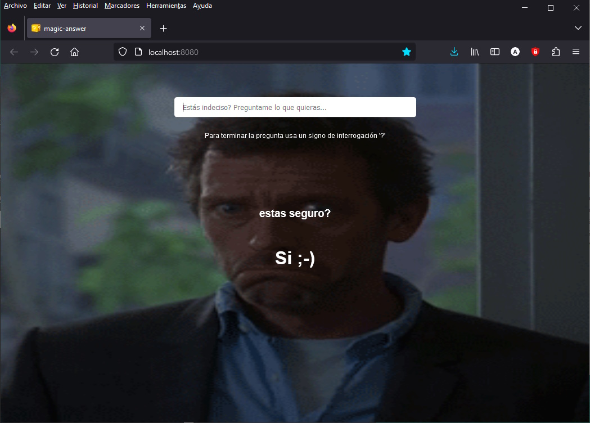

# Funny Apps

A 'magic answer' & 'pokemon trivia' games, developed in Vue 3.  

Based on Fernando Herrera's online Vue.js courses (spanish):  
- [YouTube channel](https://www.youtube.com/@DevTalles)  
- [Course: 'Vue.js: De cero a experto'](https://www.udemy.com/course/vuejs-fh/)  

&nbsp;

### Magic Answer

Ask whatever you want to get a random, gif animated, ultra AI-powered answer ;-)  
[LIVE DEMO HERE](https://andres-garcia-alves.github.io/game-funny-apps/magic-answer-game/dist/)  

### Pokemon Trivia

Try to guees to what pokemon it is based on its shape.  
[LIVE DEMO HERE](https://andres-garcia-alves.github.io/game-funny-apps/pokemon-trivia-game/dist/)  

&nbsp;

### Screenshots

| Magic Answer                                            | Magic Answer                                            |
|---------------------------------------------------------|---------------------------------------------------------|
|      |      |

| Pokemon Trivia                                          |  Pokemon Trivia                                         |
|---------------------------------------------------------|---------------------------------------------------------|
|    |    |

&nbsp;

### Requirements

If you want to run this project then you need [Node.js](https://nodejs.org) & [Vue.js](https://vuejs.org/) installed.

| Command          | Description                                                                          |
|------------------|--------------------------------------------------------------------------------------|
| `npm install`    | Install dependencies.                                                                |
| `npm run serve`  | Launch browser with the game.   Press `Ctrl + c` to kill **http-server** process. |
| `npm run build`  | To build a minified game version for production.                                     |

&nbsp;

### Version History

v1.0 (2023.09.17) - Initial release.  

&nbsp;

This is the first public release of this project.  
Enjoy!

This source code is licensed under GPL v3.0  
Please send to me your feedback about this game: andres.garcia.alves@gmail.com
